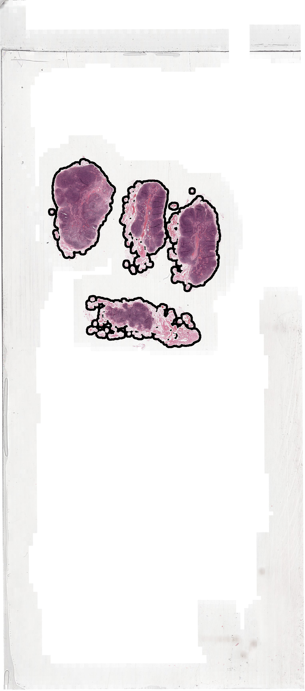
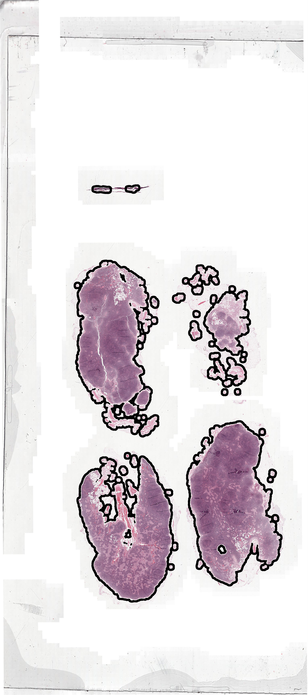

# Whole-Slide-Image sampler

 [GitHub](https://github.com/Peter554/WSI_sampler), [Docs](https://peter554.github.io/WSI_sampler/). (Docs autogenerated with [pydoc-markdown](https://github.com/NiklasRosenstein/pydoc-markdown). *To do: Images not working on docs.*)

 This respository aims to develop a tool for sampling from Whole-Slide-Images (WSIs) in an efficient manner. By sampling we mean producing batches of patches which can then be fed to e.g. machine learning algorithms. This should ideally be achieved without storing all the patches on disk (waste of storage). It aims to work with all WSIs that can be read by [openslide](https://github.com/openslide). Sample data for tests is available [here](https://www.dropbox.com/sh/khsvxpe568f77xm/AABqQYLb6SBonAe77tELccY8a?dl=0) (images from the opensource [Camelyon 16](https://camelyon17.grand-challenge.org/) dataset).

# Assumptions

- You have WSIs in a format readable by [openslide](https://github.com/openslide).
- You may also have multi-resolution-image annotation files, such as those exportable by the (excellent) slide annotation tool [ASAP](https://github.com/GeertLitjens/ASAP). For example, see the folder 'annotation' in the [sample data](https://www.dropbox.com/sh/khsvxpe568f77xm/AABqQYLb6SBonAe77tELccY8a?dl=0). The annotations can be multi-class. *The multi-resolution level structure should be the same for both the main WSI and also for the annotation*.

# Usage

Sampling is achieved through a `Single_Sampler` object, which is implemented in the module `single_sampler.py`. We first build an object:

`sampler = single_sampler.Single_Sampler(wsi_file, background_dir, annotation_dir, level0=40.)`

where

- `wsi_file` : a string path to a WSI file
- `background_dir` : a (string) directory for background masks. If this directory does not exist or no mask for this WSI is found then a background is generated and saved to this directory (creating the directory if necessary).
- `annotation_dir` : a (string) directory where annotations are stored (or `None`). We automatically look through this directory and assign the correct WSI annotation to the sampler if found, else assign no annotation.
- `level0` : the WSI (and annotation) resolution at 'level 0'.

We then prepare for sampling with something like:

`sampler.prepare_sampling(desired_downsampling, patchsize)`

where

- `desired_downsampling` : the desired downsampling. e.g. for a WSI with level0 at 40X a downsampling of 4 gives patches at 10X.
- `patchsize` : patches sampled at size (patchsize x patchsize).

At this point we are ready to sample patches with:

`sampler.sample_patches(max_per_class, savedir, verbose=0)`

where

- `max_per_class` : the maximum number of patches to get per class
- `savedir` : location to save output patchframe
- `verbose` : (bool) report number of rejected patches?

The sampled patches are saved to `savedir` in the form of a *patchframe*. A patchframe is defined as a datastructure containing coordinates of patches as well as metadata like the patch class and also the patch parent WSI, size, level. This is implemented with a [pandas](https://pandas.pydata.org/) pd.DataFrame. Note that the patches themselves are not stored! Using this database of patches we can then pass patches to a machine learning algorithm.

e.g.

```
patchframe head:
       w       h class                                             parent level size
0  30900  119768     0  /home/peter/Dropbox/publish-final/WSI_sampler_...     2  256
1  78691  170619     0  /home/peter/Dropbox/publish-final/WSI_sampler_...     2  256
2  67651  158458     0  /home/peter/Dropbox/publish-final/WSI_sampler_...     2  256
3  65468  156771     0  /home/peter/Dropbox/publish-final/WSI_sampler_...     2  256
4  40402  115702     0  /home/peter/Dropbox/publish-final/WSI_sampler_...     2  256
```

# Background generation

The background mask is stored as a downsampled, boolean numpy array where True denotes tissue and False denotes background. This is generated from the WSI using Otsu thresholding on the saturation channel followed by morphological operations. This is inspired by [this paper](https://arxiv.org/abs/1606.05718), which achieved top results in Camelyon 16 contest. The generated background mask can be visualized using e.g.

`sampler.save_background_visualization(savedir)`.

*left: Normal slides, right: Cancer slides*




# Annotation viewing

Multi-resolution annotations are best viewed with ASAP but if you want to visualize here we can with e.g.

`sampler.save_annotation_visualization(savedir)`


