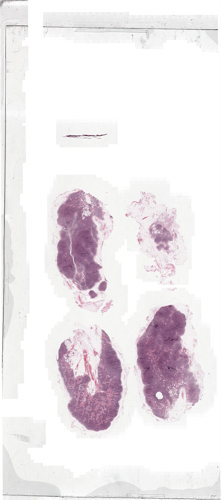
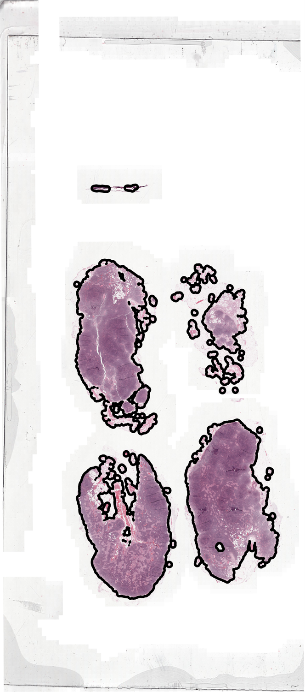
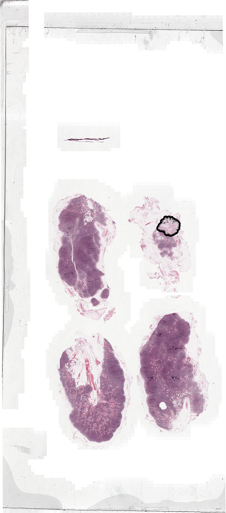
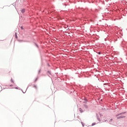
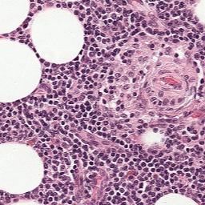
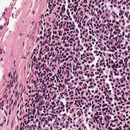
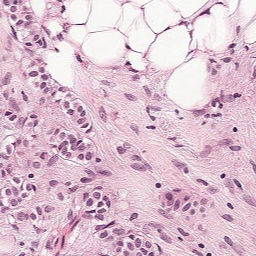
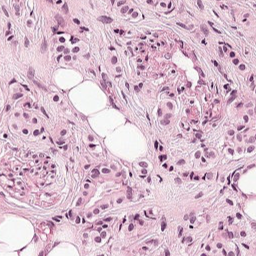
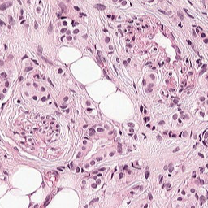

# Whole-Slide-Image sampler

[GitHub](https://github.com/Peter554/WSI_sampler), [Docs](https://peter554.github.io/WSI_sampler/). (Docs autogenerated with [pydocmd](https://github.com/NiklasRosenstein/pydoc-markdown). *To do: Images not working on docs.*)

This respository aims to develop a tool for sampling from Whole-Slide-Images (WSIs) in an efficient manner. By sampling we mean producing mini-batches of patches which can then be fed to e.g. machine learning algorithms. It aims to work with all WSIs that can be read by [openslide](https://github.com/openslide). Sample data for demos is available [here](https://www.dropbox.com/sh/khsvxpe568f77xm/AABqQYLb6SBonAe77tELccY8a?dl=0) (a single image from the [Camelyon 16](https://camelyon17.grand-challenge.org/) dataset).

When sampling patches we would like to be able to assign a class label (e.g. a binary label with normal==0 vs cancer==1). This is facilitated by adding a multi-resolution annotation mask. WSI annotations can be made efficiently with a program such as [ASAP](https://github.com/GeertLitjens/ASAP) and are often stored as xml files (see the [sample data](https://www.dropbox.com/sh/khsvxpe568f77xm/AABqQYLb6SBonAe77tELccY8a?dl=0) for example). These in turn can be converted to the multi-resolution annotation masks we want. *To do: Detail how to achieve this!*

Some features:

- `modules.slide_sampler.Slide_Sampler()`

Used to sample patches from a WSI. We can generate a background mask or add a binary multi-resolution annotation mask:

*left: WSI, middle: generated background mask, right: added annotation mask.*

*To do: CHECK annotation as xml file seems to have multiple regions!?*



We can sample patches from the different classes:

*class 0. 256x256 patches at 10X (downsampling of 4.0).*



*class 1. 256x256 patches at 10X (downsampling of 4.0).*

*To do: CHECK are these really cancer?!*



We can also generate a basic **patchframe** with this class. A patchframe is defined as a datastructure containing coordinates of patches as well as metadata like the patch class and also the patch parent WSI, size, level. Note that the patches themselves are not stored! At present this is implemented with a pd.DataFrame and it is estimated that 100,000 could be represented in this way using a memory of only a few MB on disk.

e.g.

```
patchframe head:
       w       h class                                             parent level size
0  30900  119768     0  /home/peter/Dropbox/publish-final/WSI_sampler_...     2  256
1  78691  170619     0  /home/peter/Dropbox/publish-final/WSI_sampler_...     2  256
2  67651  158458     0  /home/peter/Dropbox/publish-final/WSI_sampler_...     2  256
3  65468  156771     0  /home/peter/Dropbox/publish-final/WSI_sampler_...     2  256
4  40402  115702     0  /home/peter/Dropbox/publish-final/WSI_sampler_...     2  256

```

We can get hard copies of the patches in a patchframe for viewing with e.g. `modules.utils.save_patchframe_patches()`.
